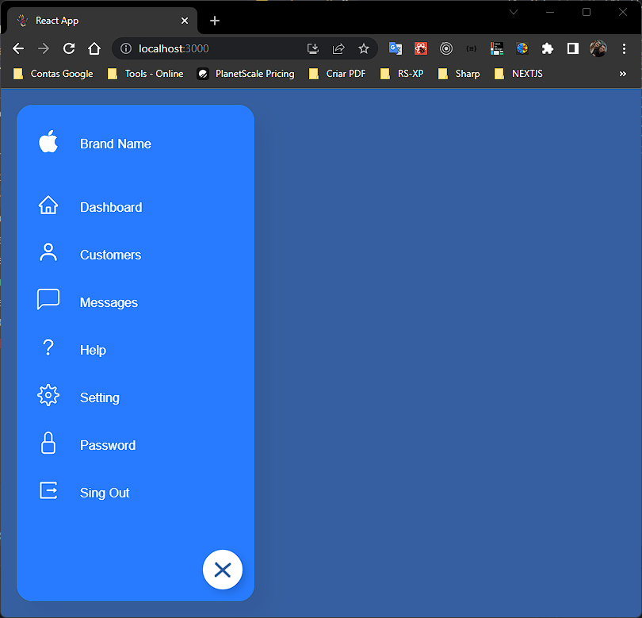
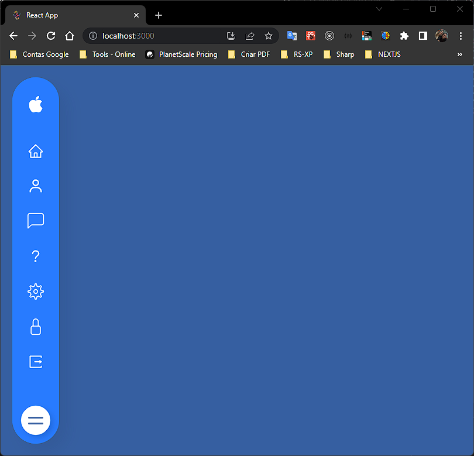
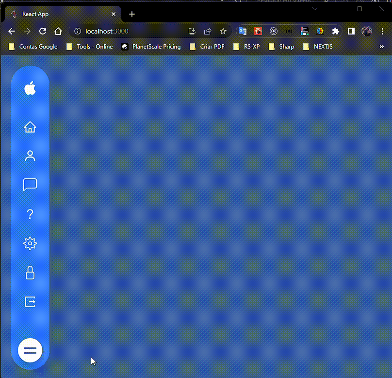

# Sidebar

Projeto desenvolvido em react criação de sidebar em reactjs

## Installation

Install my-project with npm

```bash
  git clone https://github.com/aleluizsantos/sidebar-menu-reactjs.git
  
  npm install my-project
  cd my-project

  or 

  yarn 
```
    
    

## Screenshots






## Feedback

If you have any feedback, please reach out to us at aleluizsantos@gmail.com


## Demo




## Tech Stack

    react: "^18.2.0"
    react-dom: "^18.2.0"
    react-icons: "^4.8.0"
    react-scripts: "5.0.1"
    web-vitals: "^2.1.4
## Authors

Alessandro L. Santos


